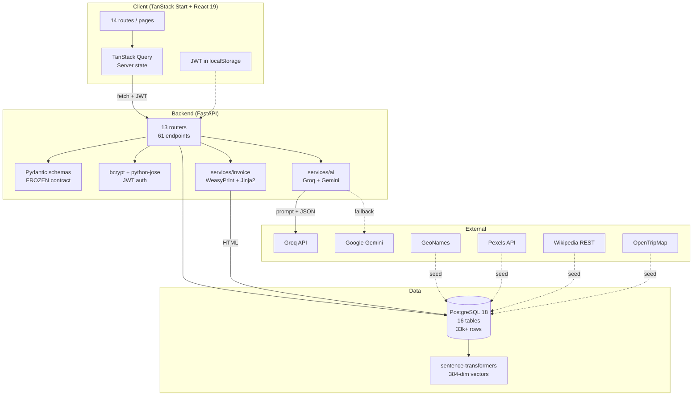

<div align="center">

<a href="https://github.com/rupeshbharambe24/SentinelX---Odoo-Hackathon-PU">
  
</a>

# Traveloop

### Plan multi-city trips that actually flow.

Map every stop, budget every day, pack smarter, and let AI scaffold the itinerary —
Traveloop turns the chaos of multi-city travel into a calm, shareable plan.

<br>

[](https://fastapi.tiangolo.com/)
[](https://www.postgresql.org/)
[](https://www.sqlalchemy.org/)
[](https://react.dev/)
[](https://typescriptlang.org/)
[](https://tailwindcss.com/)
[](https://tanstack.com/)
[](https://console.groq.com/)
[](https://ai.google.dev/)

[](https://hackathon.odoo.com/)
[]()
[]()

[**Quick start**](#-quick-start) ·
[**Features**](#-features) ·
[**Architecture**](#-architecture) ·
[**API**](#-api-surface) ·
[**Team**](#-team)

</div>

---

## ✨ What is Traveloop?

A **full-stack multi-city travel-planning platform** built by a team of four for the Odoo Hackathon 2026. Plan trips with AI, organise them into per-city *sections* with their own dates and budgets, drag-and-drop activities into the right order, log expenses, generate WeasyPrint-rendered PDF invoices, and share travel stories with the community — all backed by a real Postgres database with **33,000+ cities, 5,000+ activities, and ~430 curated photos**.

> Not a mock. Not a CRUD demo. Real relational data, real LLM round-trips, real server-side PDFs.

---

## 🎯 Highlights

<table>
<tr>
<td>

### 🏙️ Real catalog
- **33,645** cities (GeoNames)
- **5,053** activity templates (OpenTripMap)
- **427** city photos (Pexels + Wikipedia)
- **27,866** cities with cost-of-living index
- **38,698** sentence-transformer embeddings

</td>
<td>

### 🤖 AI built-in
- Groq `llama-3.3-70b-versatile` primary
- Gemini `2.5-flash` fallback
- 1-hour LRU cache (300× faster on repeat)
- Itinerary, packing list, and trip summary generators

</td>
</tr>
<tr>
<td>

### 🛣️ 61 REST endpoints
- 16 resource groups
- All typed with Pydantic v2
- Auto OpenAPI + Swagger UI
- JWT auth + role-gated admin

</td>
<td>

### 📄 Production polish
- Server-side PDF invoices (WeasyPrint)
- Multi-currency rejection
- Discount clamping
- Soft deletes via FK cascades
- Idempotent seed scripts

</td>
</tr>
</table>

---

## 🧱 Architecture



---

## 🚀 Quick start

> Requires **Python 3.11+**, **Node 20+**, and **PostgreSQL 18** running locally (or a Render Postgres URL).

### 1. Clone

```bash
git clone https://github.com/rupeshbharambe24/SentinelX---Odoo-Hackathon-PU.git traveloop
cd traveloop
```

### 2. Backend

```powershell
cd backend
python -m venv .venv
.venv\Scripts\Activate.ps1                  # macOS/Linux: source .venv/bin/activate
pip install -r requirements.txt
copy .env.example .env                      # then edit DATABASE_URL + AI keys
alembic upgrade head                        # creates the 16 tables

# Optional — populate the 33k city catalog (~10 min total):
python -m app.seed.cities                   # GeoNames -> cities (33k)
python -m app.seed.cost_index               # Numbeo CSV -> cost_index (28k)
python -m app.seed.activities               # OpenTripMap -> activity_templates (5k)
python -m app.seed.photos                   # Pexels + Wikipedia -> photo_url (~430)
python -m app.seed.embeddings               # sentence-transformers -> embeddings

uvicorn app.main:app --reload               # http://localhost:8000
```

API explorer: **http://localhost:8000/docs**

### 3. Frontend

```bash
cd frontend
npm install
npm run dev                                 # http://localhost:3000
```

### 4. Sign in

Register a new account at `/register`, or use the seeded admin account if you've imported one. Admin features unlock automatically when `users.is_admin = true`.

---

## 🌟 Features

### Trip planning
- **Create trips** with name, dates, budget, cover photo
- **Multi-city sections** — break a trip into per-city stops, each with its own dates and budget
- **Drag-and-drop reorder** of sections (one batched API call) and activities, powered by `@dnd-kit/sortable`
- **Live activity editing** — name, category, cost, duration, scheduled time, notes
- **Trip status auto-derived** from start/end dates — Ongoing / Upcoming / Completed / Draft

### AI assistance
- **POST `/ai/generate-itinerary`** — Groq builds a multi-day itinerary in ~1.5s. Cache on identical inputs returns in **<10ms**.
- **POST `/ai/generate-packing/{trip_id}`** — context-aware packing list (17 items typical), categorised into documents / clothing / electronics / toiletries / other.
- **POST `/ai/summarize/{trip_id}`** — two-sentence trip summary for the public share view.
- **Graceful fallback** — Groq → Gemini → 503 with clean message. Cache survives both.

### Budget & invoicing
- **Per-section budgets** with over-budget detection
- **Real expense tracker** with category enum (transport / stay / activity / meal / other)
- **Sync from Activities** — one click auto-creates expense rows from planned costs (idempotent — re-syncs replace previous auto rows)
- **Multi-currency rejection** — invoice fails with HTTP 400 if expenses span multiple currencies
- **Server-side PDF invoices** via **WeasyPrint** + Jinja2 — categorised line items, configurable tax, clamped discount, grand total, PAID/PENDING stamp
- **Mark as paid** workflow with persisted status

### Discovery
- **Cities catalog** — search 33k cities by name, country, popularity; view country-level cost index
- **Activity templates** — search 5k OpenTripMap places by name, category, max cost
- **Recommended cities** — top by popularity score with real photos
- **Semantic search stub** — embeddings populated, Python cosine similarity

### Community
- **Rich post composer** — headline, story, image URLs, tags, link to a trip; live preview
- **Sort by recent / most liked**, **server-side search**, **dynamic tag filter chips**
- **Optimistic likes** with persisted state
- **Inline comment threads** — lazy-loaded, with reply box (Enter to send)
- **Web Share API** with clipboard fallback

### Personal
- **Per-trip packing list** with category grouping, progress bar, AI-generate button
- **Per-trip notes / journal** with per-day index
- **User profile** with editable bio (first/last name, phone, city, country)
- **Trip listing** with three tabs (Ongoing / Upcoming / Completed)
- **Saved destinations** API surface

### Admin (gated by `is_admin`)
- **/admin/stats** — total users, total trips, trips today, active 30d
- **/admin/popular/cities** — most-pinned cities by trip section count
- **/admin/popular/activities** — most-used activity templates
- **/admin/users** — paginated user list with trip counts
- **/admin/trends** — trips-per-day for last N days
- **/admin/recent** — most recently created trips

---

## 🔌 API surface

61 endpoints across 13 routers. Group breakdown:

| Group | Endpoints | Highlight |
|---|---:|---|
| `/auth` | 6 | register · login · refresh · me · forgot · reset |
| `/users` | 7 | profile · photo upload · saved destinations |
| `/trips` | 14 | full CRUD · cover · publish · copy · public read |
| `/sections` | 5 | CRUD + reorder + by-trip |
| `/activities` | 4 | CRUD + reorder + flowchart linking |
| `/expenses` | 5 | CRUD + budget breakdown |
| `/packing` | 5 | CRUD + toggle + reset |
| `/notes` | 4 | per-trip and per-section CRUD |
| `/community` | 8 | posts + comments + like-toggle |
| `/cities` + `/activity-templates` | 6 | catalog + semantic search |
| `/ai` | 3 | itinerary + packing + summary |
| `/invoice` | 5 | get · generate · update · mark-paid · pdf |
| `/admin` | 6 | stats · popular · users · trends · recent |

Full interactive docs: open **http://localhost:8000/docs** after `uvicorn app.main:app`.

---

## 🗄️ Database

**16 tables** with foreign keys, JSONB columns, and self-references. All managed by Alembic.

```
users · cities · activity_templates · trips · trip_sections · trip_activities
expenses · invoices · invoice_items · packing_items · trip_notes
community_posts · community_comments · community_likes
saved_destinations · trip_copies
```

Live counts after running the seed pipeline:

```
$ psql -d traveloop -c "
  SELECT 'cities' AS tbl, count(*) FROM cities
  UNION ALL SELECT 'activity_templates', count(*) FROM activity_templates
  UNION ALL SELECT 'cities_with_photo', count(*) FROM cities WHERE photo_url IS NOT NULL
  UNION ALL SELECT 'cities_with_cost_index', count(*) FROM cities WHERE cost_index IS NOT NULL
  UNION ALL SELECT 'cities_with_embedding', count(*) FROM cities WHERE embedding IS NOT NULL;"

         tbl          | count
----------------------+--------
 cities               | 33645
 activity_templates   |  5053
 cities_with_photo    |   427
 cities_with_cost_index | 27866
 cities_with_embedding | 33645
```

---

## 🧰 Tech stack

<table>
<tr>
<td>

**Backend**
- FastAPI 0.115
- SQLAlchemy 2.0
- Alembic
- Pydantic v2 + pydantic-settings
- python-jose + passlib[bcrypt 4.2]
- WeasyPrint + Jinja2
- groq + google-generativeai
- sentence-transformers
- pandas + rapidfuzz (seed scripts)

</td>
<td>

**Frontend**
- React 19 + TypeScript
- Vite + TanStack Start (SSR)
- TanStack Router (file-based routing)
- TanStack Query (server state)
- Tailwind CSS 4 + shadcn/ui
- React Hook Form + Zod
- @dnd-kit/sortable
- Recharts
- Sonner (toasts)
- date-fns

</td>
</tr>
</table>

**Data sources:** GeoNames · Numbeo (Cost-of-Living-Index 2024) · OpenTripMap · Pexels · Wikipedia REST API

**LLM providers:** Groq (`llama-3.3-70b-versatile`) primary · Google Gemini (`gemini-2.5-flash`) fallback

---

## 👥 Team

| Member | Branch | Owns |
|---|---|---|
| **Rupesh Bharambe** | [`feat/core`](../../tree/feat/core) | Core backend, models/schemas/routers, integration, deploy |
| **Aniket Wahul** | [`feat/frontend`](../../tree/feat/frontend) | React frontend, all 14 screens, design system |
| **Harshal More** | [`feat/data-admin`](../../tree/feat/data-admin) | 5 seed scripts, cost-of-living matching, 6 admin endpoints |
| **Onkar Kalyankar** | [`feat/ai-invoice`](../../tree/feat/ai-invoice) | Groq + Gemini client, itinerary/packing/summary generators, WeasyPrint invoice PDFs |

Each member's contributions live on their branch and are merged into `main`. Browse [the full commit graph](../../graphs/contributors) to see authorship.

---

## 📂 Repository layout

```
traveloop/
├─ backend/
│  ├─ app/
│  │  ├─ core/         config · db · security (JWT)
│  │  ├─ models/       16 SQLAlchemy classes (FROZEN)
│  │  ├─ schemas/      13 Pydantic modules (FROZEN integration contract)
│  │  ├─ routers/      13 FastAPI routers (auth/users/trips/.../admin)
│  │  ├─ services/
│  │  │  ├─ ai/        client + itinerary + packing + summary
│  │  │  ├─ invoice/   builder + WeasyPrint pdf
│  │  │  └─ trip_status.py
│  │  ├─ seed/         5 idempotent seed scripts + run_all
│  │  ├─ templates/    invoice.html (Jinja2)
│  │  └─ main.py
│  ├─ alembic/         migrations
│  ├─ data/            CSV + cached downloads
│  └─ requirements.txt
├─ frontend/
│  ├─ src/
│  │  ├─ components/   shadcn UI primitives + app shell
│  │  ├─ lib/          api fetch wrapper · auth · utils
│  │  ├─ routes/       16 file-based routes (TanStack Router)
│  │  └─ styles.css
│  └─ package.json
├─ docker-compose.yml  Postgres for local dev
└─ README.md           you are here
```

---

## 🎬 Demo

> **Demo video:** _(link to be added with submission)_

Local demo flow once both servers are up:

1. Register at `/register` → auto-redirect to dashboard
2. **Plan a Trip** → fill destination + dates + interests → click **"Suggest with AI"** → 1.5s later you have a full itinerary
3. Open the **Builder** tab → drag sections to reorder, add activities
4. **Budget** tab → click **"Sync from Activities"** → expenses populate
5. **Invoice** tab → click **"Download PDF"** → real WeasyPrint PDF
6. **Packing** tab → click **AI Suggestions** → 17 categorised items
7. **Community** → share a story with images and tags
8. Sign in as admin → **Analytics** shows the platform-wide admin section

---

## 🏆 Hackathon context

Built for [Odoo Hackathon 2026](https://hackathon.odoo.com/) under the rubric:

> ✅ **Proper relational database** — 16 tables, real FKs, JSONB, embeddings
> ✅ **Dynamic UI** — TanStack Query + optimistic mutations + Tailwind 4
> ✅ **Robust input validation** — Pydantic v2 on every request, Zod on every form
> ✅ **Git used by all members** — four branches, clean per-author history
> ✅ **AI used thoughtfully** — Groq primary + Gemini fallback + caching, not "AI on everything"

---

<div align="center">

Built with ☕ and curiosity by **Rupesh, Aniket, Harshal, and Onkar** in ~8 hours.

⭐ Star the repo if you find it useful · 🐛 Open an issue if you spot a bug

</div>
